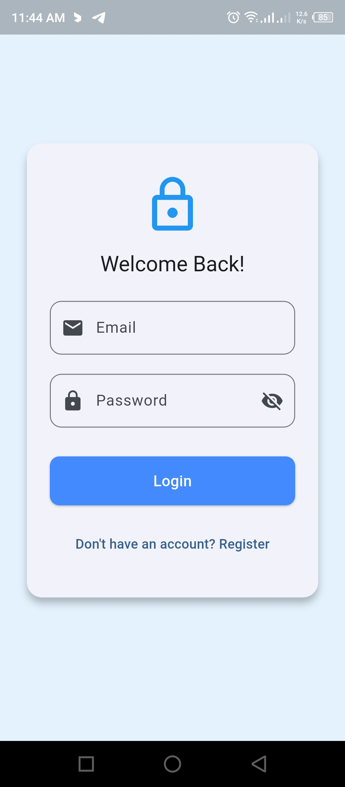
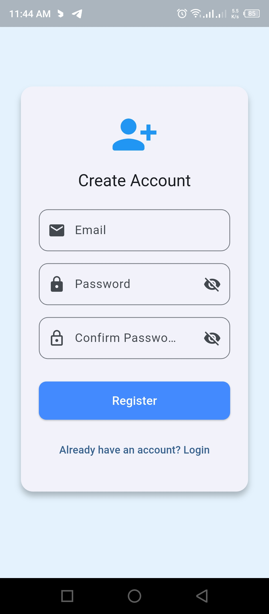
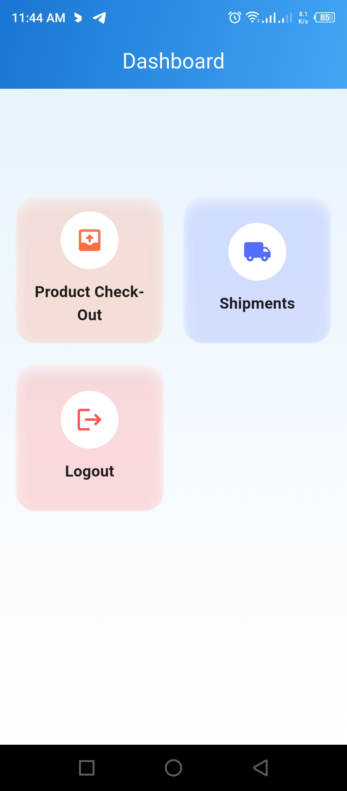
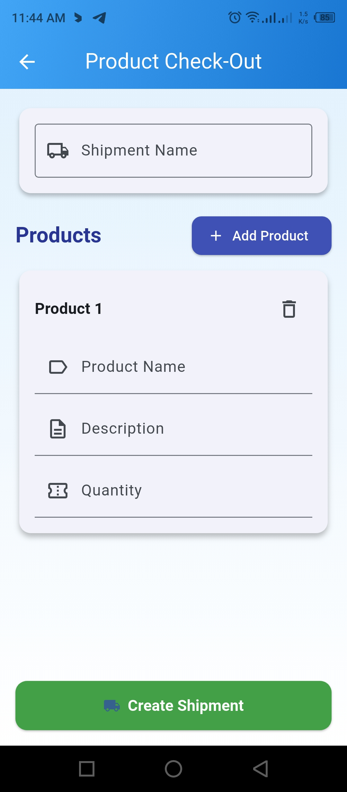
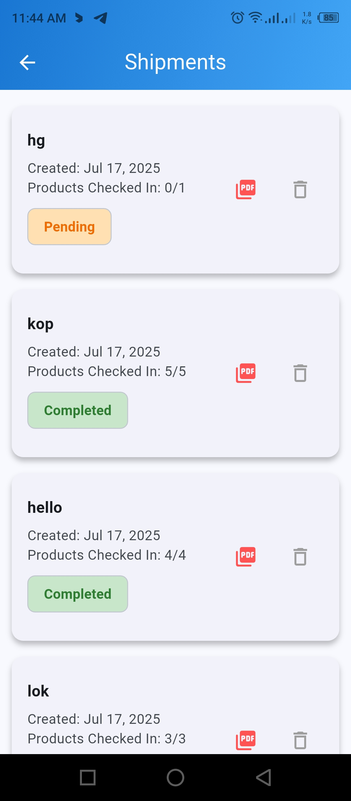
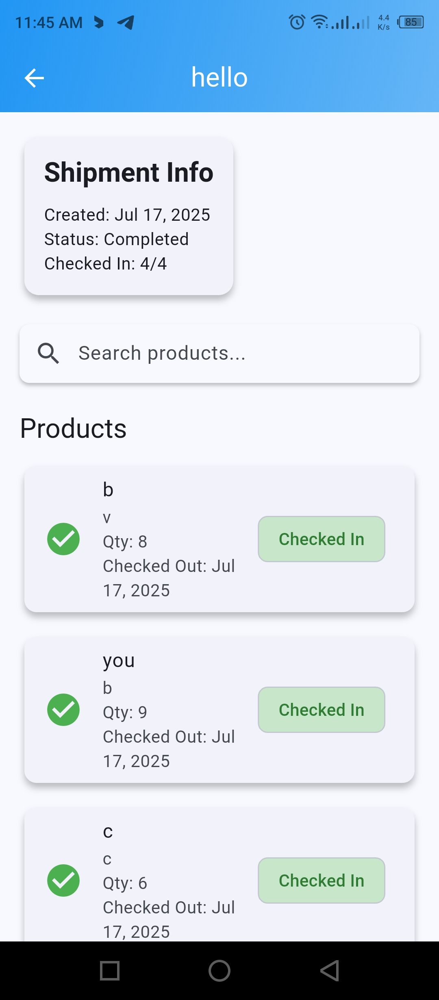
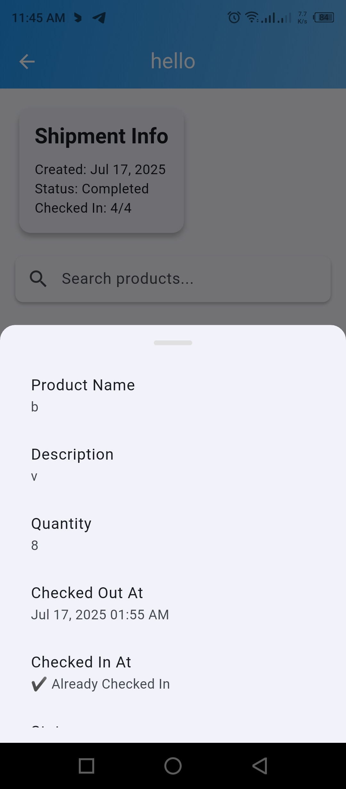

# 📦 Flutter Shipment Management App

A modern Flutter application for managing product shipments, check-ins, and PDF reporting — built with Firestore, Provider, and clean UI with glassmorphism design.

## ✨ Features

- 🔐 **Authentication**
  - User registration and login
  - Form validation and error handling

- 📦 **Shipment Management**
  - Create and manage multiple shipments
  - View shipment details with real-time status
  - Check in products per shipment
  - Soft-completion and deletion of shipments

- 📋 **Product Tracking**
  - Add products with details (name, quantity, description)
  - Real-time product check-in status
  - Search and filter products per shipment

- 📄 **PDF Report Generation**
  - Generate detailed shipment reports
  - Share PDF directly from the app

- 💅 **Beautiful UI**
  - Glassmorphism cards with blurred effects
  - Gradient backgrounds and modern design
  - Responsive layout and user-friendly interaction

## 🖼️ Screenshots

| Log In | Registration | Home Screen | Checkout |
|--------|--------------|-------------|----------|
|  |  |  |  |

| Shipment List | Shipment Details | Product Details |
|---------------|------------------|------------------|
|  |  |  |

## 🧱<Tech StackA breakdown of the core technologies used in the Flutter Shipment Management Ap 

| Layer         | Technology / Package                                                                 |
|---------------|---------------------------------------------------------------------------------------|
| **Frontend**  | [Flutter](https://flutter.dev/) - UI toolkit for building natively compiled apps     |
| **UI Design** | Material Components, Custom Theming, Glassmorphism (BackdropFilter + gradients)      |
| **State Mgmt**| [Provider](https://pub.dev/packages/provider) - Simple and scalable state management |
| **Backend**   | [Firebase](https://firebase.google.com/) - Backend as a Service (BaaS)               |
|               | • [Firebase Authentication](https://firebase.google.com/products/auth)               |
|               | • [Cloud Firestore](https://firebase.google.com/products/firestore)                  |
| **PDF Export**| [pdf](https://pub.dev/packages/pdf) - Generate PDF documents in Dart                 |
|               | [share_plus](https://pub.dev/packages/share_plus) - Share files or text              |
| **File Access**| [path_provider](https://pub.dev/packages/path_provider) - Access local directories  |
| **Routing**   | Named route navigation in Flutter (`Navigator.pushNamed`)                            |
| **Form Fields**| Flutter Form, Validators, and Controllers                                           |

---

💡 _This modular stack ensures scalability, performance, and smooth user experience across platforms._
